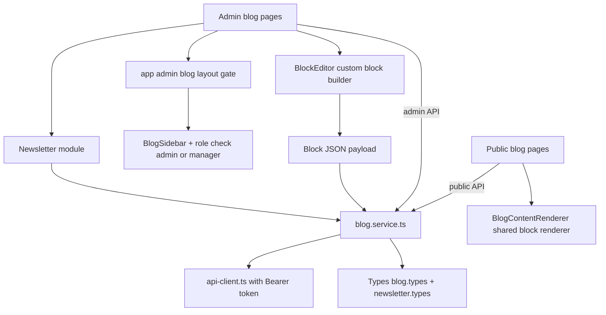

# Remopay Blog & Newsletter — Frontend Implementation Plan

## Decisions (confirmed with user)

1. **Scope:** Full system end-to-end — public blog + admin/manager management + newsletter + analytics, delivered in ordered phases.
2. **Admin access:** Dedicated `/admin/blog` route group with its own layout and role gate for `admin` + `manager`.
3. **Content editor:** Custom lightweight block editor emitting the exact backend JSON block schema — **no new dependencies**.
4. **Public rendering:** Single-article page is a **Next.js Server Component** with `generateMetadata` + JSON-LD for best SEO. Listing/search/category/tag pages are client components for interactivity.

## Stack alignment

- Services: class-based singletons via [`api-client.ts`](src/services/api-client.ts:31) (base URL already ends `/api/v1`; service paths omit the prefix, e.g. `/public/blog/posts`, `/admin/blog/posts`). Re-exported from [`src/services/index.ts`](src/services/index.ts:1).
- Types: per-domain files under [`src/types/`](src/types/index.ts:1), re-exported from the index.
- Admin UI: reuse [`AdminHeader`](src/components/admin/AdminHeader.tsx:15), [`AdminTable`](src/components/admin/AdminTable.tsx:30), [`AdminStats`](src/components/admin/AdminStats.tsx:44), [`Card`](src/components/shared/Card.tsx:10), [`Button`](src/components/shared/Button.tsx:41), [`Badge`](src/components/shared/Badge.tsx:24), [`Input`](src/components/shared/Input.tsx:13), [`Select`](src/components/shared/Select.tsx:13), [`Modal`](src/components/shared/Modal.tsx:25), [`FilterPanel`](src/components/shared/FilterPanel.tsx:1) + [`useFilters`](src/hooks/useFilters.ts:44), [`Toast`](src/components/shared/Toast.tsx:7) via [`useUIStore`](src/store/ui.store.ts:45).
- Charts: `recharts` (already a dependency) for analytics.
- Design: primary `#d71927`, white cards with gray borders, existing typography tokens, consistent empty/loading states.

## API surface to cover (from the integration guide)

- **Public:** `GET /public/blog/posts`, `/posts/search`, `/posts/featured`, `/posts/latest`, `/posts/popular`, `/posts/{slug}`, `/posts/{slug}/related`, `/categories`, `/categories/{slug}/posts`, `/tags`, `/tags/{slug}/posts`, `POST /public/newsletter/subscribe`, `GET /public/newsletter/unsubscribe`.
- **Admin (`/admin/blog`):** dashboard overview + analytics; category & tag CRUD; post CRUD + `publish` / `schedule` / `archive` / `feature`; `images/upload`; newsletter list/create, `calculate-targets`, detail, `send` / `schedule` / `cancel` / `preview` / `test`, recipients, stats.

## Route map

```
Public (no auth)
  /blog                          -> client listing (search, sort, featured/latest/popular, pagination)
  /blog/[slug]                   -> SERVER COMPONENT + generateMetadata + JSON-LD + related posts
  /blog/category/[slug]          -> client filtered listing
  /blog/tag/[slug]               -> client filtered listing
  /blog/unsubscribe              -> client page handling token/email unsubscribe

Admin/Manager (auth: admin | manager)
  /admin/blog                    -> overview cards + recent posts/campaigns
  /admin/blog/analytics          -> recharts (publication+views series, top posts, newsletter totals)
  /admin/blog/categories         -> CRUD list + create/edit modal + search/is_active filter
  /admin/blog/tags               -> CRUD list + create/edit modal
  /admin/blog/posts              -> list (status/search/sort), actions (publish/schedule/archive/feature/delete)
  /admin/blog/posts/new          -> post form + block editor + image upload + SEO + relations
  /admin/blog/posts/[id]/edit    -> same form, pre-filled
  /admin/blog/newsletter         -> campaign history with status/search filters
  /admin/blog/newsletter/new     -> create (eligible article + audience + calculate-targets)
  /admin/blog/newsletter/[id]    -> detail: stats, preview iframe, test, send, schedule, cancel, recipients
```

## Architecture



## Key components to create

**Public**
- `BlogPostCard`, `BlogSearchBar`, `CategoryPill`, `TagPill`, `BlogBreadcrumbs`, `BlogSkeletons`, `BlogPagination`
- `BlogContentRenderer` (server-safe JSX renderer for all 11 block types — shared with admin preview)
- `NewsletterSubscribeForm` (+ embed in `/blog` sidebar, optionally footer)
- `RelatedPosts`

**Admin/Manager**
- `BlogSidebar` / blog nav (posts, categories, tags, newsletter, analytics, overview)
- `BlogPostForm` (title, slug, summary, images via `ImageUploader`, status/schedule, SEO, category/tag multi-select, related-post picker, `newsletter_eligible`)
- `BlockEditor` + per-block editors: heading, paragraph, list, quote, code, table, image, video, callout, link, divider (add/reorder/delete, live preview, block JSON validation)
- `ImageUploader` (multipart via `apiClient` — handled for FormData, returns `image_url`)
- `PostStatusBadge`, `ConfirmActionModal`, `ScheduleModal`, `FeatureToggleModal`
- `CategoryFormModal`, `TagFormModal`
- `NewsletterCampaignForm`, `AudienceSelector` (with `calculate-targets` preview), `NewsletterStatsCards`, `NewsletterRecipientsTable`, `NewsletterPreviewModal` (iframe), `ConfirmSendModal`
- `BlogAnalyticsCharts` (recharts)

## Phase breakdown (see todo list)

1. **Foundation** — blog + newsletter types, services, shared block renderer.
2. **Public blog** — listing/search/category/tag pages, server-rendered article w/ SEO + JSON-LD, subscribe/unsubscribe, sitemap touch-up.
3. **Admin shell** — extend `app/admin/layout.tsx` gate to `admin | manager`, add blog nav; create `/admin/blog` layout + overview.
4. **Categories & tags CRUD.**
5. **Posts + custom block editor + image upload.**
6. **Newsletter module** (history, create, audience, preview/test/send/schedule/cancel, recipients, stats).
7. **Analytics + consistency polish** (permission-aware actions, error envelope handling, responsive states).

## Notes / gotchas

- Only `published` articles with `published_at <= now` are public; list items exclude `content` (fetch single article for full content).
- Fetching `GET /posts/{slug}` increments `view_count` — only call it on the actual article view (server component).
- Use `POST /posts/{id}/publish | schedule | archive` for workflow transitions, not direct `status` edits; `feature` body is `{ is_featured: true }`.
- Newsletter create requires a published, `newsletter_eligible`, never-sent article; sending is async (queued) — poll `/newsletter/{id}/stats`.
- Parent `app/admin/layout.tsx` currently blocks non-`admin`; blog layout gate handles `admin | manager`, so the parent gate must be relaxed to allow both roles (blog is the manager-accessible area).
- Error envelope: surface backend `errors.details` (field-level) in forms; toast the top-level `message`.
