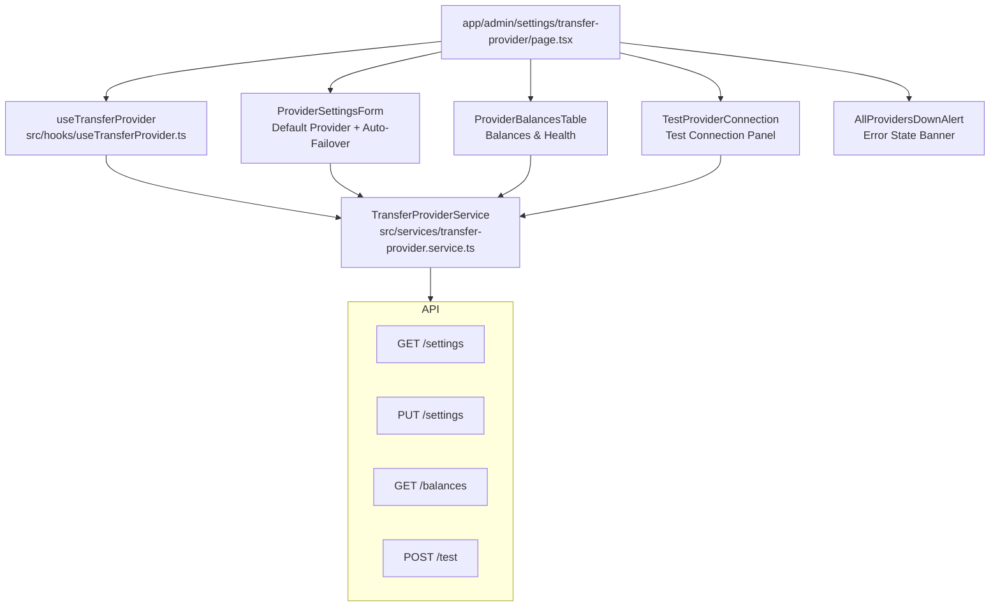
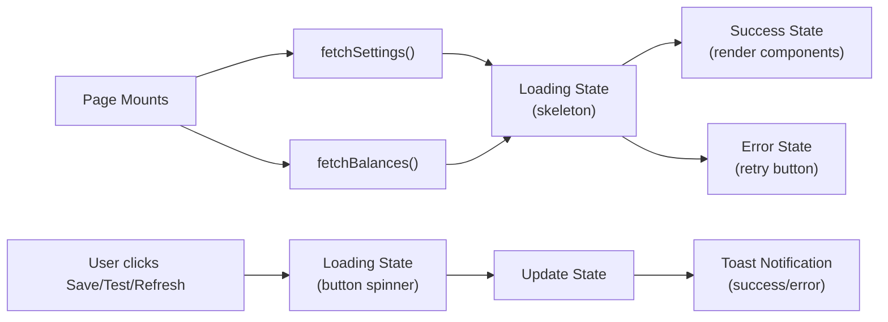

# Transfer Provider Management - Implementation Plan

## Overview

Implement admin dashboard panels for managing multi-provider bank transfers (Paystack, Kuda, Maplerad). This includes viewing real-time balances, setting the default provider, configuring auto-failover thresholds, testing connections, and viewing health status.

## Design Principles

- **Clean & Professional**: Minimal, functional aesthetic
- **Color Palette**: Black (`#111827`), gray (`#6b7280`, `#e5e7eb`, `#f9fafb`), white, brand red (`#d71927`)
- **No gradients, no childish icons** — use minimal UI indicators (text-based badges, simple geometric shapes)
- **Consistency**: Match existing admin patterns (Card, Button components, Tailwind classes)

---

## File Structure

```
src/types/transfer-provider.types.ts          # Type definitions
src/services/transfer-provider.service.ts     # API service class
src/hooks/useTransferProvider.ts              # React hook with state management
src/components/admin/transfer-provider/
  ├── index.ts                                # Barrel exports
  ├── ProviderSettingsForm.tsx                # Default provider + auto-failover
  ├── ProviderBalancesTable.tsx               # Balance/health dashboard widget
  ├── TestProviderConnection.tsx              # Test connection panel
  └── AllProvidersDownAlert.tsx               # Error state banner
app/admin/settings/transfer-provider/
  └── page.tsx                                # Route page
```

---

## Step 1: Type Definitions (`src/types/transfer-provider.types.ts`)

Define the following types matching the API contract:

```typescript
// Provider identifiers
export type TransferProviderCode = 'paystack' | 'kuda' | 'maplerad';

// Provider metadata
export interface TransferProviderMeta {
  code: TransferProviderCode;
  display_name: string;
  balance: number;
  threshold: number;
  healthy: boolean;
  configured: boolean;
}

// Settings response
export interface TransferProviderSettings {
  default_provider: TransferProviderCode;
  auto_switch: boolean;
  low_balance_threshold_paystack: number;
  low_balance_threshold_kuda: number;
  low_balance_threshold_maplerad: number;
}

// Update settings request
export interface UpdateTransferProviderSettingsRequest {
  default_provider?: TransferProviderCode;
  auto_switch?: boolean;
  low_balance_threshold_paystack?: number;
  low_balance_threshold_kuda?: number;
  low_balance_threshold_maplerad?: number;
}

// Balances response data
export interface TransferProviderBalancesData {
  default_provider: TransferProviderCode;
  auto_switch: boolean;
  providers: Record<TransferProviderCode, TransferProviderMeta>;
  active_provider: TransferProviderCode;
  overall_status: 'healthy' | 'degraded' | 'unavailable';
}

// Test connection
export interface TestProviderConnectionRequest {
  provider: TransferProviderCode;
}

export interface TestProviderConnectionData {
  provider: TransferProviderCode;
  connected: boolean;
  balance: number;
  message: string;
  latency_ms: number;
}

// Health status display info
export type ProviderHealthStatus = 'healthy' | 'low' | 'unavailable' | 'inactive';

export interface ProviderHealthInfo {
  status: ProviderHealthStatus;
  label: string;
  color: string; // Tailwind color class
  bgColor: string;
  dotColor: string;
}
```

---

## Step 2: API Service (`src/services/transfer-provider.service.ts`)

Create a `TransferProviderService` class following the existing pattern:

```typescript
class TransferProviderService {
  async getSettings(): Promise<ApiResponse<TransferProviderSettings>>
  async updateSettings(data: UpdateTransferProviderSettingsRequest): Promise<ApiResponse<TransferProviderSettings>>
  async getBalances(): Promise<ApiResponse<TransferProviderBalancesData>>
  async testConnection(data: TestProviderConnectionRequest): Promise<ApiResponse<TestProviderConnectionData>>
}
```

**API Endpoints** (from the spec):
- `GET /api/v1/admin/transfer-provider/settings`
- `PUT /api/v1/admin/transfer-provider/settings`
- `GET /api/v1/admin/transfer-provider/balances`
- `POST /api/v1/admin/transfer-provider/test`

---

## Step 3: Hook (`src/hooks/useTransferProvider.ts`)

Follow the established pattern from `useSettlement.ts`:

- **State interface**: `UseTransferProviderState` with settings, balances, test results, loading/error states
- **Operations**:
  - `fetchSettings()` — GET settings
  - `updateSettings(data)` — PUT settings, with success toast
  - `fetchBalances()` — GET balances
  - `testConnection(provider)` — POST test, with result display
- **Error handling**: Uses `useUIStore.addToast` for success/error feedback
- **Loading states**: Individual per-operation loading flags

---

## Step 4: UI Components

### 4a. `ProviderSettingsForm.tsx`

Two sections in a single form:

**Section 1 — Default Transfer Provider**
- Radio group with 3 options: Paystack, Kuda, Maplerad
- Clean label with "(current)" badge on selected
- No icons — pure text
- Using native `<input type="radio">` styled with Tailwind

**Section 2 — Auto-Failover Configuration**
- Toggle/checkbox for `auto_switch`
- 3 number inputs for provider thresholds, labeled with provider names
- NGN currency prefix (`₦`)
- Save button at bottom (shared for both sections)

**States**: Loading skeleton, error state, success state

### 4b. `ProviderBalancesTable.tsx`

A clean table/card layout showing:
- Provider name
- Balance (formatted as NGN)
- Status badge (Active/Inactive)
- Threshold amount
- Health indicator (dot + text: Healthy/Low/Unavailable)

**Health Indicators** (from spec):
| Status | Indicator |
|--------|-----------|
| Healthy | Green dot + "Healthy" text |
| Low | Yellow/amber dot + "Low" text |
| Unavailable | Red dot + "Unavailable" |
| Inactive | Gray dot + "Inactive" |

- Refresh button at top-right
- Default provider highlighted subtly (border-left or background tint)
- Overall status bar at bottom

### 4c. `TestProviderConnection.tsx`

- Provider dropdown select
- "Test Connection" button (brand red)
- Result panel below (hidden until tested):
  - Connection status (checkmark or X)
  - Balance display
  - Latency in ms
- Loading state during test

### 4d. `AllProvidersDownAlert.tsx`

- Red-bordered alert card with error header
- List each provider with its failure reason
- System impact notice
- Dismiss + Retry All buttons
- Conditionally shown based on `overall_status === 'unavailable'`

---

## Step 5: Route Page (`app/admin/settings/transfer-provider/page.tsx`)

Following the pattern from [`app/admin/settlements/config/page.tsx`](app/admin/settlements/config/page.tsx:1):

- `'use client'` Next.js page
- Fetches settings and balances on mount
- Renders the three components (Settings, Balances, Test) in a vertical layout
- Back button linking to `/admin/settings`
- Page title: "Transfer Provider Settings"
- Loading, error, and empty states handled

**Layout**:
```
┌─ Back + Title ─────────────────────────────┐
│ Transfer Provider Settings                  │
│ Manage bank transfer providers, balances... │
├────────────────────────────────────────────┤
│ ProviderBalancesTable (balances widget)     │
├────────────────────────────────────────────┤
│ ProviderSettingsForm (settings)            │
├────────────────────────────────────────────┤
│ TestProviderConnection (test panel)        │
└────────────────────────────────────────────┘
```

---

## Step 6: Admin Layout Navigation

Add to [`app/admin/layout.tsx`](app/admin/layout.tsx:29) `adminNavItems` array:

```typescript
{ label: 'Transfer Providers', href: '/admin/settings/transfer-provider', icon: Settings },
```

Import `Settings` from `lucide-react`.

---

## Step 7: Update Services Export

Add to [`src/services/index.ts`](src/services/index.ts:1):
```typescript
export { transferProviderService } from './transfer-provider.service';
```

---

## Component Architecture Diagram



---

## State Management Flow



---

## TypeScript Safety

- All API responses typed as `ApiResponse<T>` with strict generics
- Form data interfaces with optional fields for partial updates
- Provider codes as union type (`'paystack' | 'kuda' | 'maplerad'`) to prevent typos
- Proper null/undefined handling in hook state
- Number inputs coerced with `Number()` before API submission
